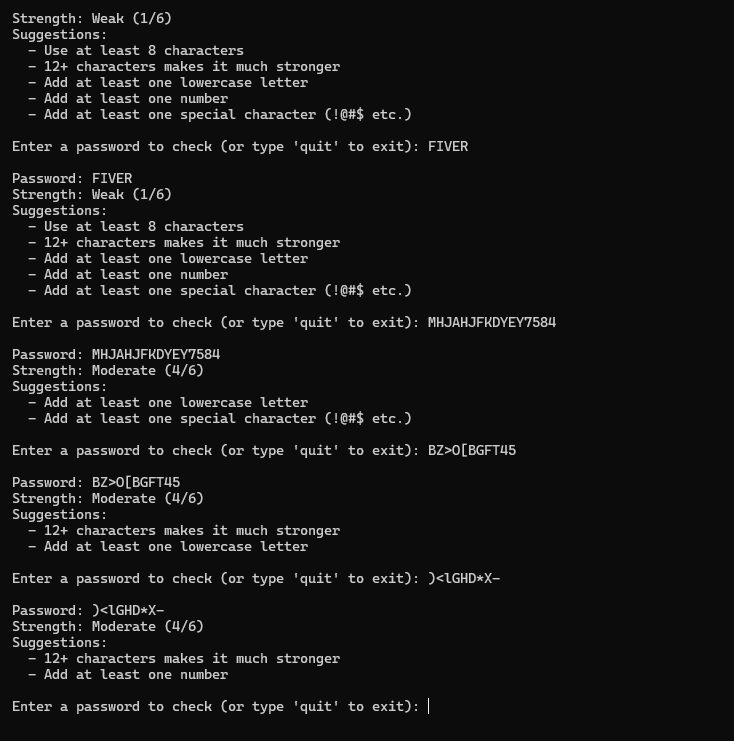

# password-strength-checker

A Python tool that evaluates how strong a password is and gives actionable feedback to improve it.

## What it does
- Checks password length, uppercase, lowercase, numbers, and special characters
- Detects commonly used weak passwords
- Scores the password out of 6 and labels it Weak / Moderate / Strong
- Gives specific suggestions to improve the password

## Technologies used
- Python 3
- `re` module (regular expressions)

## How to run it
1. Make sure Python is installed
2. Clone the repo: `git clone https://github.com/zainabaijaz257/password-strength-checker`
3. Run: `password_checker.py`

## Screenshot

## What I learned
Built this project to apply regular expressions and control flow logic in a real-world cybersecurity context. 
Password validation is a core concept in access control and user authentication systems.

## Author
Zainab Aijaz · [LinkedIn](www.linkedin.com/in/zainab-aijaz-7513a73a5) · [GitHub](https://github.com/zainabaijaz257)
